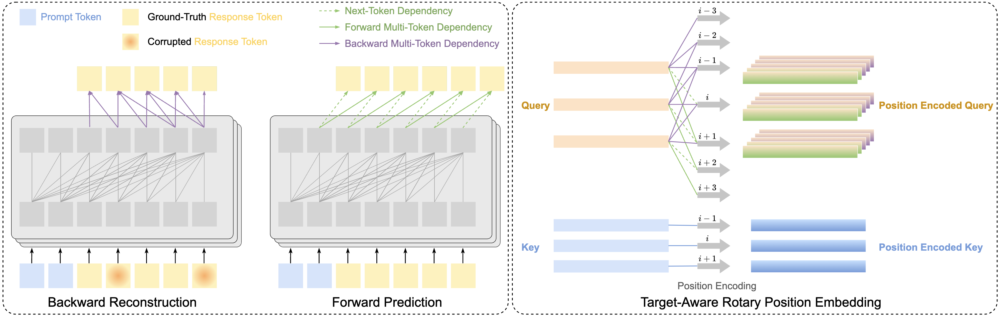

# Context-Wise Order-Agnostic Language Modeling

This repository contains code and analysis for the paper: [COrAL: Order-Agnostic Language Modeling for Efficient Iterative Refinement](). Below is the framework of our proposed method.

* Training Objective implementation: [`coral/algorithms/oa`](./coral/algorithms/oa)

* Modeling and Inference implementation: [`coral/models/oa_model`](./coral/models/oa_model)




## Environment Setup

```bash
conda env create --file conda-recipe.yaml
pip install -r requirements.txt

conda activate coral
```

## Running Scripts: [`scripts`](./scripts)

* Conventional AR SFT

```bash
gpus=0,1,2,3,4,5,6,7
bash scripts/sft-arithmetic.sh $gpus
```

* COrAL on final layer only
```bash
gpus=0,1,2,3,4,5,6,7
bash scripts/coral-stage1-arithmetic.sh $gpus
```

* COrAL on whole architecture
```bash
gpus=0,1,2,3,4,5,6,7
bash scripts/coral-stage2-arithmetic.sh $gpus
```

## TODO
- [ ] Demo of running on different tasks
- [ ] Demo of inference with Sliding Blockwise Order-Agnostic Decoding
- [ ] Support KV-Cache in inference

## Citation

```
@article{xie2024coral,
  title={COrAL: Order-Agnostic Language Modeling for Efficient Iterative Refinement},
  author={Xie, Yuxi and Goyal, Anirudh and Wu, Xiaobao and and Yin, Xunjian and Xu, Xiao and Kan, Min-Yen and Pan, Liangming and Wang, William Yang},
  year={2024}
}
```

---
<sub><sup>This repository is adapted from the code of the works [Safe-RLHF](https://github.com/PKU-Alignment/safe-rlhf). </sup></sub>
